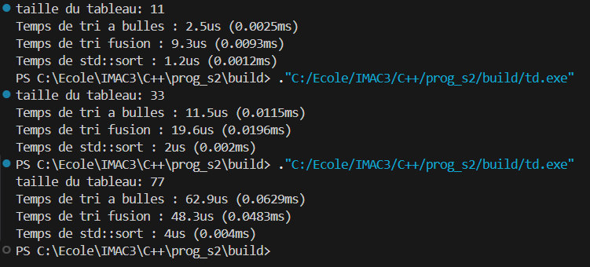

# Avec cette fonction, vous pouvez comparer les temps d'exécution de vos algorithmes de tri avec celui de la bibliothèque standard.

## Que constatez-vous ?
La bibliothèque standard est beaucoup plus rapide que les deux autres.
La fonction tri à bulles est plus rapide que le tri par fusion quand le tableau contient peu d’éléments.
En revanche, lorsque le nombre d’éléments augmente, le tri par fusion devient plus efficace et dépasse largement le tri à bulles.

## Que pouvez-vous en dire ?

Ce comportement est attendu, car :
Tri à bulles : O(n²) -> le temps augmente très vite quand n devient grand
Tri par fusion : O(n log n) -> le temps augmente beaucoup moins vite pour de grands tableaux